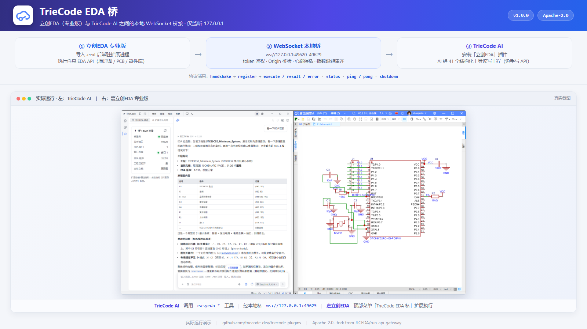

# TrieCode EDA 桥（triecode-easyeda-gateway）

在立创EDA（EasyEDA 专业版）与 TrieCode AI 之间建立本地桥接：将 EDA 的扩展 API 通过 WebSocket（仅 127.0.0.1 回环）暴露给 TrieCode 插件进程，使 AI 可以**读写原理图 / PCB、搜索器件库、执行任意 EDA API**。

> 本扩展基于官方 `run-api-gateway` fork 改造，受 **Apache-2.0** 约束，原作者 **JLCEDA**（见随包 `LICENSE` / `NOTICE`）。

## 功能演示



> 上图示意：扩展在立创EDA 内以「TrieCode EDA 桥」菜单常驻（含重新连接 / 停止连接 / 切换自动连接 / 关于），自动连接本地桥后在原理图画布中响应 AI 的读写操作；右侧为 TrieCode AI 侧调用 `easyeda_*` 工具、经桥执行并回传结果。

## 功能

- 启动本地 WebSocket 桥（端口 49620–49629），只监听 `127.0.0.1`
- 用令牌（token）鉴权 + Origin 校验，阻断非白名单来源（含 `null` / `file://` 伪装）
- 支持多 EDA 窗口：按 `order` 分配、随真实焦点（`SYS_Window` focus 事件）切换活动窗口
- 安全序列化大对象（ArrayBuffer 分块 base64），指数退避重试，心跳保活
- 收到 `shutdown` 优雅退出，通知 EDA 扩展后再关闭

## 使用方法

1. 在立创EDA 顶部菜单 **高级 → 扩展管理器**，导入本 `.eext`；
2. 勾选「**允许外部交互**」（及可选「显示在顶部菜单」）；
3. 保持 EDA 窗口打开，桥会自动监听回环端口等待 TrieCode 连接；
4. 在 TrieCode 中安装并启用「立创EDA」插件（`easyeda-toolchain`），AI 即可通过桥操作 EDA。

## 权限说明

本扩展**只做本地桥接**，不收集、不上传任何个人数据；网络连接仅限 `127.0.0.1`。令牌与端口号由 TrieCode 插件动态下发，不写死、不入包。

## 构建

```bash
npm install
npm run build        # 产出 build/dist/<name>_v<version>.eext
```

## 许可证

Apache-2.0。fork 自官方 `run-api-gateway`（© JLCEDA），修改过的文件已在 `NOTICE` 声明。产品名不含「EasyEDA / 嘉立创EDA」商标（仅功能描述与开源标题提及）。
